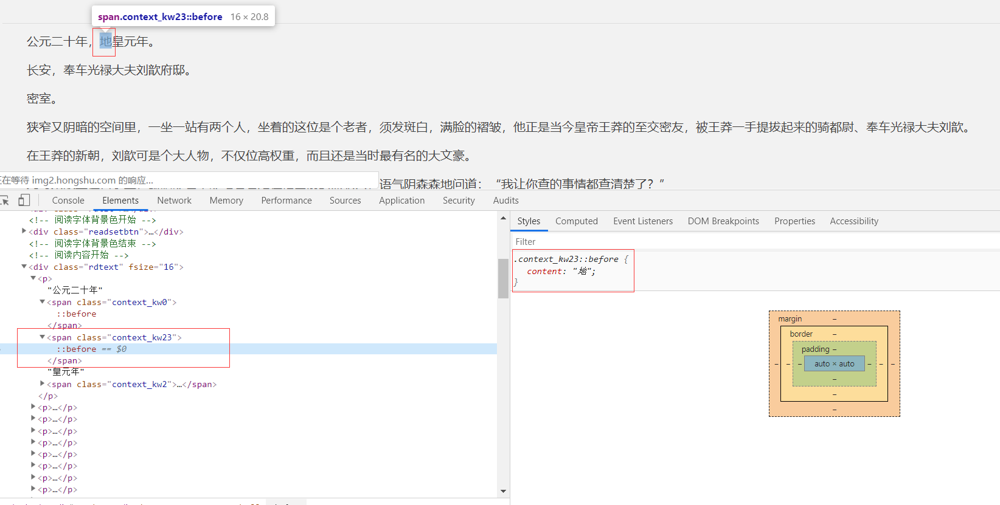
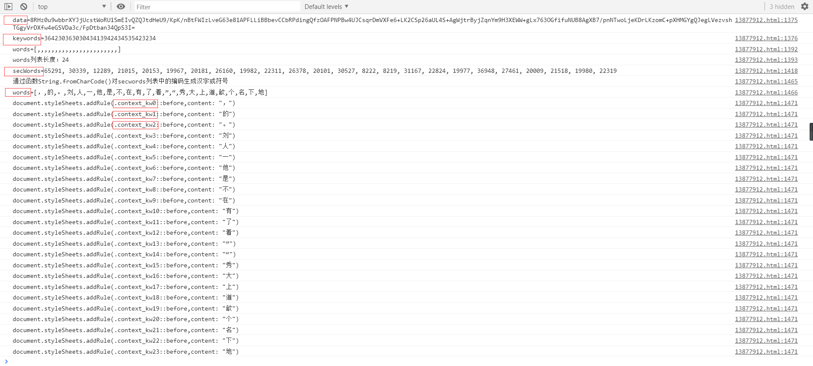

# 红薯中文网小说爬取

#### 描述
红薯中文小说网，采用了js动态加载小说内容部分汉字或符号。本仓库介绍如何破解js将小说内容完整的爬取下来。

我们首先用浏览器F12查看下页面情况，页面连接：https://g.hongshu.com/content/93416/13877912.html

图片中少量汉字都是使用```span```标签对应上去的，我们在点击span标签的时候在右边可以看到
```css
.context_kw23::before {
    content: "地";
}
```
很显然，这些内容是通过js动态加载上去的。我们仔细观察所有span标签，看他的类属性都是以```context_kw```开头，后面再加上数字编号。我们可以大胆猜测每一个数字编号对应一个汉字或符号。然后我们再研究js。与我们相关的js就在响应的html中。<a href="./getWords.js">js</a>
研究发现编码对应的汉字或符号在```words```变量中，索引与数字编号对应。

上图是调试js的截图
- data是加密过的内容，keywords是解码的密码，通过js中的解密函数生成了编码的列表secWords，然后通过```fromCharCode```函数生成对应的汉字列表words

js代码写的很复杂，其实大可不必研究其生成过程（先研究的可以从words生成地方往回推），可以将js代码复制到本地进行运行，生成我们所需要的words列表即可。  
附上全部代码：
```python
import requests
from lxml import etree
import re
#import execjs

def seedRequest(url,header):
    response = requests.get(url=url,headers=header)
    response.encoding = "utf8"
    return response.text

def func(obj):
    span = obj.group(0)
    num = re.findall('context_kw(\d{1,2})', span, re.I)[0]
    try:
        replace = words[int(num)]
        return replace
    except KeyError:
        print("未找到编号%s的汉字"%num)
        return "#"
    
def htmlReplace(html):
    responseReplace = re.sub('<span class="context_kw\d*?"></span>', func, html)
    return responseReplace

# def get_words_js():
#     with open("./getWords.js","r",encoding="utf8") as fp:
#         js = fp.read()
#     ctx = execjs.compile(js)
#     return ctx.call('parseWord')

def getContentHtml(html):
    tree = etree.HTML(html)
    title = tree.xpath("//div[@class='lf']/h1/text()")[0]
    text = tree.xpath("///div[@class='rdtext']/p/text()")
    concatText = "".join(text)
    print(title)
    print(concatText)
    
if __name__ == '__main__':
    header = {
        "authority": "g.hongshu.com",
        "method": "GET",
        "path": "/content/93416/13877912.html",
        "scheme": "https",
        "accept": "text/html,application/xhtml+xml,application/xml;q=0.9,image/webp,image/apng,*/*;q=0.8,application/signed-exchange;v=b3",
        "cookie": "pgv_pvi=7004054528; bookfav=%7B%22b93416%22%3A0%7D; pgv_si=s2563727360; Hm_lvt_e966b218bafd5e76f0872a21b1474006=1566288274,1566295321,1566460817; Hm_lpvt_e966b218bafd5e76f0872a21b1474006=1566460817; yqksid=u5j08hk2dgmrtj0hirfv0niss2",
        "upgrade-insecure-requests": "1",
        "user-agent": "Mozilla/5.0 (Windows NT 10.0; Win64; x64) AppleWebKit/537.36 (KHTML, like Gecko) Chrome/75.0.3770.100 Safari/537.36"
    }
    url = "https://g.hongshu.com/content/93416/13877912.html"
    words = ["，","的","。","刘","人","一","他","是","不","在","有","了","着","”","“","秀","大","上","道","歆","个","名","下","地"]
    
    html = seedRequest(url,header)
    getContentHtml(htmlReplace(html))
```
> 上面代码注释掉的函数是python运行本地js的函数，有兴趣的可以研究下。我的因为js文件中有语法问题运行失败了（在浏览器运行没问题）

多多指正：768348710@qq.com